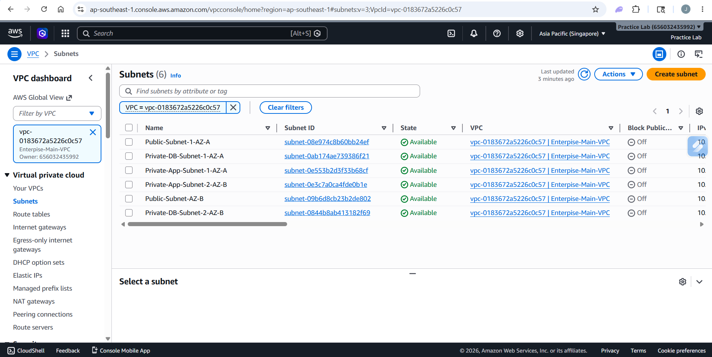
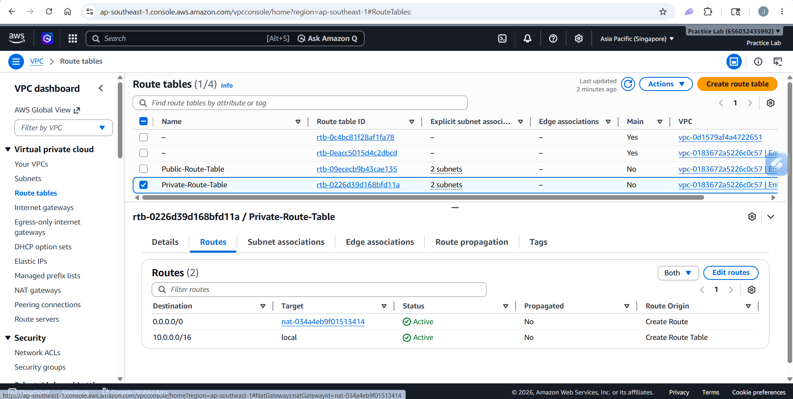
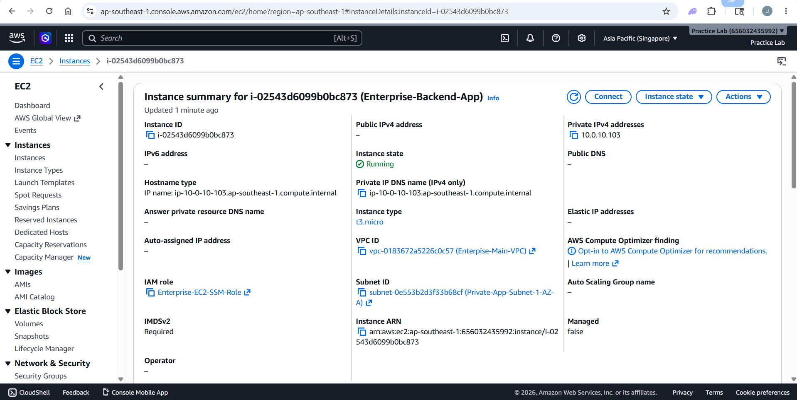
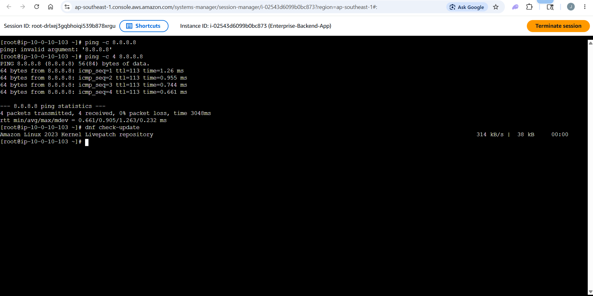
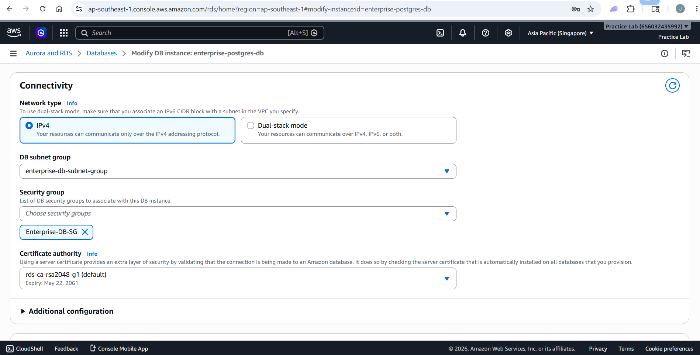

# Enterprise-Grade Multi-AZ 3-Tier Web Architecture on AWS

## Project Overview
Proyek ini mendokumentasikan implementasi arsitektur jaringan 3-Tier Web Architecture berskala korporat (*enterprise-grade*) di atas platform AWS. Infrastruktur ini dirancang dengan prinsip High Availability (HA), Fault Tolerance, dan Zero-Trust Network Isolation lintas 2 Availability Zones (Multi-AZ) sesuai dengan *AWS Well-Architected Framework*.

### Architecture Highlights:
* Presentation Tier: Public Load Balancer untuk mendistribusikan traffic publik secara merata.
* Application Tier: Server backend terisolasi di dalam Private Subnet dengan akses internet keluar satu arah via NAT Gateway.
* Data Tier: Database Amazon RDS PostgreSQL terisolasi total tanpa akses internet untuk keamanan data absolut.
* Security Isolation: Menerapkan metode *Security Group Chaining* dan akses *keyless* menggunakan AWS Systems Manager (SSM).

---

## Network Topology & VLSM Subnetting Plan

Infrastruktur ini dialokasikan pada CIDR Block utama sebesar **10.0.0.0/16** (65,536 IP) dan dipecah secara presisi menggunakan tekVLSMSM** ke dalam 6 subnet lintas Availability Zones (ap-southeast-3a & ap-southeast-3b):

| Tier | Subnet Name | Availability Zone | CIDR Block | Total IP | Function |
| :--- | :--- | :--- | :--- | :--- | :--- Tier 1: Webeb** | Public-Subnet-1-AZ-A | ap-southeast-3a | 10.0.1.0/24 | 251 | Internet Gateway & NAT Gateway |
| | Public-Subnet-2-AZ-B | ap-southeast-3b | 10.0.2.0/24 | 251 | Internet Gateway & Load Balancer Tier 2: Apppp** | Private-App-Subnet-1-AZ-A | ap-southeast-3a | 10.0.10.0/23 | 507 | EC2 Backend Application |
| | Private-App-Subnet-2-AZ-B | ap-southeast-3b | 10.0.12.0/23 | 507 | EC2 Backend Application Tier 3: Datata** | Private-DB-Subnet-1-AZ-A | ap-southeast-3a | 10.0.20.0/24 | 251 | Amazon RDS (Primary Instance) |
| | Private-DB-Subnet-2-AZ-B | ap-southeast-3b | 10.0.21.0/24 | 251 | Amazon RDS (Standby Instance) |

### Network Foundation Proof:
Berikut adalah hasil visualisasi pembagian 6 subnet Multi-AZ yang sukses terkonfigurasi di AWS Console:

---

## Routing Tables & Internet Connectivity

Untuk menjamin keamanan, rute komunikasi diatur secara ketat melalui pemisahan Route Tables:Public Route Table:e:** Menghubungkan Subnet Public secara dua arah ke internet publik melaInternet Gateway (IGW)W)** (0.0.0.0/0 -> igw-xxxx).Private Route Table:e:** Menghubungkan Subnet Application secara satu arah ke internet melaNAT Gateway (Zonal)l)** untuk kebutuhan update patch tanpa mengekspos server ke publik.

### Routing ProofsPublic Route Target (IGW):):**
:):**
:):**

---

## Firewall Berlapis: Chained Security Groups

Proyek ini tidak menggunakan hardcoded IP pada aturan firewall, melainkan menerapSecurity Group Chainingng** di mana satu security group mengotorisasi security group tingkat selanjutnya.

[ Internet ] ---> [ Enterprise-ALB-SG ] (Ports 80/443)
│
▼
[ Enterprise-App-SG ] (Port 8080) Only accepts from ALB-SG
│
▼
[ Enterprise-DB-SG ]  (Port 5432) Only accepts from App-SG

### Security Group Isolation Proof:
Bukti inbound rule pada Database Tier (Enterprise-DB-SG) yang terkunci rapat dan hanya menerima koneksi dari Application Tier (Enterprise-App-SG):

---

## Compute Tier Deployment & Keyless Management

Server backend aplikasi dijalankan di atas EC2 Instance (t2/t3.micro) di dalam Private-App-Subnet-1-AZ-A dengan kondisi:
* No Public IP assigned.
* Keyless Architecture: Tidak menggunakan file kunci tradisional (.pem/.ppk). Manajemen akses remote dilakukan secara aman dan ter-audit via AWS Systems Manager (SSM) Session Manager dengan IAM Role Enterprise-EC2-SSM-Role.

### EC2 Instance Status:

---

## Infrastructure Validation & Testing

### 1. Egress Internet Connectivity (NAT Gateway Test)
Melakukan pengujian konektivitas keluar dari dalam EC2 Private Instance via SSM Session Manager. Server terbukti sukses melakukan *handshake* dan mengunduh data dari internet via NAT Gateway dengan 0% Packet Loss, sementara inbound traffic tetap terblokir total.

### Validation Terminal Screenshot:

### 2. Isolated Database Tier Deployment
Database dikelompokkan ke dalam DB Subnet Group lintas wilayah untuk fondasi Multi-AZ dan berhasil dikonfigurasi tanpa akses publik.

### Database Configuration Status:
* DB Subnet Group Multi-AZ Boundary:

* Isolated Database Instance:

---

## Architectural Note on Cost Optimization
> Enterprise Production Design vs PoC:
> Dalam skenario industri nyata, arsitektur ini berjalan menggunakan Amazon RDS Multi-AZ Deployment (Active-Passive Automatic Failover) dan Dual NAT Gateways lintas Availability Zones untuk menjamin zero-downtime. 
> Namun, untuk kebutuhan *Proof of Concept (PoC)* dan efisiensi biaya (*Cost Optimization*), infrastruktur saat pengujian disesuaikan menggunakan *Single-AZ (Free-Tier Eligible)* dengan tetap mempertahankan isolasi jaringan, aturan biner subnetting, dan parameter keamanan yang identik dengan standar produksi.
